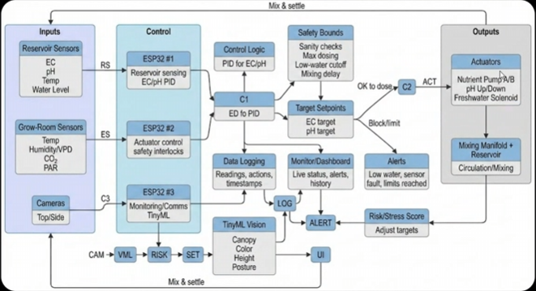

# 🧠 System Architecture (What the Diagram Represents)



## 1️⃣ Objectives

### Market Objectives (Sabah)

1. **Lower operating cost and labor for local growers** through remote monitoring, alerts, and automated dosing/top-up—minimizing nutrient waste, pump runtime, and manual checking.

## System Overview (How the System Works)

The system runs as a **closed-loop hydroponic controller**: it continuously measures reservoir and grow-room conditions, compares them against target setpoints, then automatically doses nutrients/pH or adjusts water level. Each action is followed by a mixing and verification step so corrections are stable rather than “overshooting.”

Typical operating cycle:

1.  **Sense:** electrical conductivity [EC], pH, temperature level are sampled from the reservoir.

2.  **Decide:** The controller applies control rules (PID for EC/pH) and safety bounds (sanity checks, max dosing limits, low-water cutoff) to determine whether any correction is needed.

        *Short situation (example):* The EC target is **1.8 mS/cm**, but after a hot day + top-up with freshwater the sensor reads **1.3 mS/cm**. The PID logic suggests adding Nutrient A/B to raise EC, but the safety checks run first:
        - If the **water level is too low**, dosing is blocked (to protect pumps) and an alert is triggered.
        - If EC is low and water level is OK, the controller only doses **up to the max limit per cycle**, then waits for mixing before deciding again.

3.  **Actuate:** If values are out of range, the controller runs the relevant actuator (nutrient pumps A/B, pH up/down,

4.  **Mix & settle:** Dosed solution passes through the mixing manifold; the system waits a defined mixing delay timer to ensure readings reflect the new concentration.
5.  **Verify & log:** Sensors are read again to confirm the correction, and all readings/actions are logged for traceability and optimization.

Optional: In parallel, cameras can periodically run **vision + morphology inference**

## Assumption, water ph level always maintain at neutral

**Controller:** ESP32 x3

- Reads sensors
- Runs PID loops (EC + pH)
- Runs TinyML vision model
- Controls dosing pumps
- Logs data
- Integrate with monitor

---

## Detailed Interaction Flowchart (Component-to-Component)

```mermaid
flowchart TD
        %% Inputs
        subgraph Inputs
                RS[Reservoir Sensors\nEC • pH • Temp • Water Level\n(optional: Dissolved Oxygen)]
                ES[Grow-Room Sensors (optional)\nTemp • Humidity/VPD • CO₂ • PAR]
                CAM[Cameras (optional)\nTop/Side]
        end

        %% Compute / control
        subgraph Control[ESP32 Controllers (x3)]
                C1[ESP32 #1\nReservoir sensing + EC/pH PID]
                C2[ESP32 #2\nActuator control + safety interlocks]
                C3[ESP32 #3\nMonitoring/Comms + TinyML (if enabled)]
        end

        %% Safety + logic blocks
        PID[Control Logic\nPID for EC/pH]
        SAFE[Safety Bounds\nSanity checks\nMax dosing per cycle\nLow-water cutoff\nMixing delay timer]
        SET[Target Setpoints\nEC target • pH target\n(optional: environment targets)]

        %% Outputs
        subgraph Outputs
                ACT[Actuators\nNutrient Pump A/B\npH Up/Down\nFreshwater Solenoid\n(optional: Ca/Mg)]
                MIX[Mixing Manifold + Reservoir\nCirculation/Mixing]
        end

        %% Monitoring
        LOG[Data Logging\nReadings • actions • timestamps]
        UI[Monitor/Dashboard\nLive status • alerts • history]
        ALERT[Alerts\nLow water • sensor fault • limits reached]

        %% Vision branch
        VML[TinyML Vision (optional)\nCanopy/Color/Height/Posture]
        RISK[Risk/Stress Score\nAdjust targets (within safety)]

        %% Main loop
        RS --> C1
        ES --> C3
        CAM --> VML --> RISK --> SET

        SET --> PID
        C1 --> PID --> SAFE
        SAFE -->|OK to dose| C2 --> ACT --> MIX
        SAFE -->|Block/limit| ALERT

        MIX -->|Mix & settle| RS

        %% Logging + UI
        C1 --> LOG
        C2 --> LOG
        C3 --> LOG
        LOG --> UI
        ALERT --> UI
        C3 --> UI
```

This flow shows the continuous loop: **Sense → Decide (PID + safety) → Actuate → Mix → Verify → Log/Monitor**, with an optional vision path that can _suggest_ setpoint changes while safety bounds still control what the system is allowed to do.

---

## 2️⃣ Reservoir Control Section

**Sensors inside reservoir:**

- EC probe
- pH probe
- Temperature probe
- Dissolved oxygen sensor
- Water level sensor

**Actuators:**

- Peristaltic Pump A (Baja Nutrient A)
- Peristaltic Pump B (Baja Nutrient B)
- Freshwater solenoid valve

All lines feed into a **mixing manifold** before entering the reservoir.

---

## 3️⃣ Grow Channel Loop

```
Reservoir → Feed Pump → Grow Tray (DWC/NFT/etc.)
Grow Tray → Return Line → Reservoir
```

Continuous recirculation ensures uniform nutrient mixing.

---

## 4️⃣ Vision + Morphology Layer

**Top Camera**

- Canopy coverage
- Color analysis
- Growth rate

**Side Camera**

- Height
- Leaf angle
- Curl / droop detection

**ML detects:**

- Tip burn probability
- Chlorosis patterns
- Necrosis
- Morphology stress indicators

Outputs adjust:

- EC setpoint
- Calcium supplementation
- Environmental targets

---

# 🔁 Closed-Loop Logic (Visual Flow)

```
Sensors → Controller → Dose → Mix → Measure → Adjust
        ↘
         Vision ML → Risk Score → Adjust Targets
```

---

# 🔒 Safety Controls

- Maximum dosing limits
- Sensor sanity bounds
- Mixing delay timers
- Low water cutoff
- Alert system

---

https://vercel.com/home
